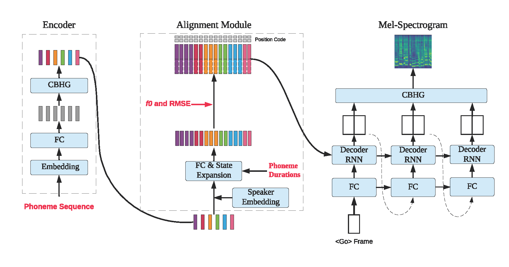

# 
LEARNING SINGING FROM SPEECH

Liqiang Zhang, Chengzhu Yu, Heng Lu, Chao Weng, Yusong Wu, Xiang Xie, Zijin Li, Dong Yu

Tencent AI Lab

## Abstract

 We propose an algorithm that is capable of synthesizing high quality target speaker's singing voice given only their normal speech samples. The proposed algorithm first integrate speech and singing synthesis into a unified framework, and learns universal speaker embeddings that are shareable between speech and singing synthesis tasks. Specifically, the speaker embeddings learned from normal speech via the speech synthesis objective are shared with those learned from singing samples via the singing synthesis objective in the unified training framework. This makes the learned speaker embedding a transferable representation for both speaking and singing. We evaluate the proposed algorithm on singing voice conversion task where the content of original singing is covered with the timbre of another speaker's voice learned purely from their normal speech samples. Our experiments indicate that the proposed algorithm generates high-quality singing voices that sound highly similar to target speaker’s voice given only his or her normal speech samples. We believe that proposed algorithm will open up new opportunities for singing synthesis and conversion for broader users and applications. 
 

 

 

## Sound Samples

 
\* Note: All samples are in Mandrin Chinese.
 
\* The singing conversion samples of 1 singer, 3 male speakers and 3 female speakers are shown here.
 
\* There are 5 same singing segments for each speaker and singer.
 
\* The "Source Voice" is from training data.

 

<table align="center">
  <thead>
    <tr>
      <th> </th>
      <th>Source Voice</th>
      <th>Singing Sample 1</th>
      <th>Singing Sample 2</th>
      <th>Singing Sample 3</th>
      <th>Singing Sample 4</th>
      <th>Singing Sample 5</th>
    </tr>
  </thead>
  <tbody>
    <tr>
      <th>Female Singer1</th>
      <td><audio controls="" preload="auto">
            <source src="wavs/song_dx_801000013.wav"></audio></td>
      <td><audio controls="" preload="auto">
            <source src="wavs/dx_r_1.wav"></audio></td>
      <td><audio controls="" preload="auto">
            <source src="wavs/dx_r_2.wav"></audio></td>
      <td><audio controls="" preload="auto">
            <source src="wavs/dx_r_3.wav"></audio></td>
      <td><audio controls="" preload="auto">
            <source src="wavs/dx_r_4.wav"></audio></td>
      <td><audio controls="" preload="auto">
            <source src="wavs/dx_r_5.wav"></audio></td>
    </tr>
    <tr>
      <th>Female Speaker1</th>
      <td><audio controls="" preload="auto">
            <source src="wavs/daj_000023.wav"></audio></td>
      <td><audio controls="" preload="auto">
            <source src="wavs/daj_r_1.wav"></audio></td>
      <td><audio controls="" preload="auto">
            <source src="wavs/daj_r_2.wav"></audio></td>
      <td><audio controls="" preload="auto">
            <source src="wavs/daj_r_3.wav"></audio></td>
      <td><audio controls="" preload="auto">
            <source src="wavs/daj_r_4.wav"></audio></td>
      <td><audio controls="" preload="auto">
            <source src="wavs/daj_r_5.wav"></audio></td>
    </tr>
    <tr>
      <th>Male Speaker1</th>
      <td><audio controls="" preload="auto">
            <source src="wavs/liu_88010505.wav"></audio></td>
      <td><audio controls="" preload="auto">
            <source src="wavs/liu_r_1.wav"></audio></td>
      <td><audio controls="" preload="auto">
            <source src="wavs/liu_r_2.wav"></audio></td>
      <td><audio controls="" preload="auto">
            <source src="wavs/liu_r_3.wav"></audio></td>
      <td><audio controls="" preload="auto">
            <source src="wavs/liu_r_4.wav"></audio></td>
      <td><audio controls="" preload="auto">
            <source src="wavs/liu_r_5.wav"></audio></td>
    </tr>
    <tr>
      <th>Female Speaker2</th>
      <td><audio controls="" preload="auto">
            <source src="wavs/gui_10000224.wav"></audio></td>
      <td><audio controls="" preload="auto">
            <source src="wavs/gui_r_1.wav"></audio></td>
      <td><audio controls="" preload="auto">
            <source src="wavs/gui_r_2.wav"></audio></td>
      <td><audio controls="" preload="auto">
            <source src="wavs/gui_r_3.wav"></audio></td>
      <td><audio controls="" preload="auto">
            <source src="wavs/gui_r_4.wav"></audio></td>
      <td><audio controls="" preload="auto">
            <source src="wavs/gui_r_5.wav"></audio></td>
    </tr>
    <tr>
      <th>Male Speaker2</th>
      <td><audio controls="" preload="auto">
            <source src="wavs/lpl_sample.wav"></audio></td>
      <td><audio controls="" preload="auto">
            <source src="wavs/lpl_r_1.wav"></audio></td>
      <td><audio controls="" preload="auto">
            <source src="wavs/lpl_r_2.wav"></audio></td>
      <td><audio controls="" preload="auto">
            <source src="wavs/lpl_r_3.wav"></audio></td>
      <td><audio controls="" preload="auto">
            <source src="wavs/lpl_r_4.wav"></audio></td>
      <td><audio controls="" preload="auto">
            <source src="wavs/lpl_r_5.wav"></audio></td>
    </tr>
    <tr>
      <th>Female Speaker3</th>
      <td><audio controls="" preload="auto">
            <source src="wavs/ssx_08010642.wav"></audio></td>
      <td><audio controls="" preload="auto">
            <source src="wavs/ssx_r_1.wav"></audio></td>
      <td><audio controls="" preload="auto">
            <source src="wavs/ssx_r_2.wav"></audio></td>
      <td><audio controls="" preload="auto">
            <source src="wavs/ssx_r_3.wav"></audio></td>
      <td><audio controls="" preload="auto">
            <source src="wavs/ssx_r_4.wav"></audio></td>
      <td><audio controls="" preload="auto">
            <source src="wavs/ssx_r_5.wav"></audio></td>
    </tr>
    <tr>
      <th>Male Speaker3</th>
      <td><audio controls="" preload="auto">
            <source src="wavs/025_000009.wav"></audio></td>
      <td><audio controls="" preload="auto">
            <source src="wavs/025_r_1.wav"></audio></td>
      <td><audio controls="" preload="auto">
            <source src="wavs/025_r_2.wav"></audio></td>
      <td><audio controls="" preload="auto">
            <source src="wavs/025_r_3.wav"></audio></td>
      <td><audio controls="" preload="auto">
            <source src="wavs/025_r_4.wav"></audio></td>
      <td><audio controls="" preload="auto">
            <source src="wavs/025_r_5.wav"></audio></td>
    </tr>
  </tbody>
</table>

 
