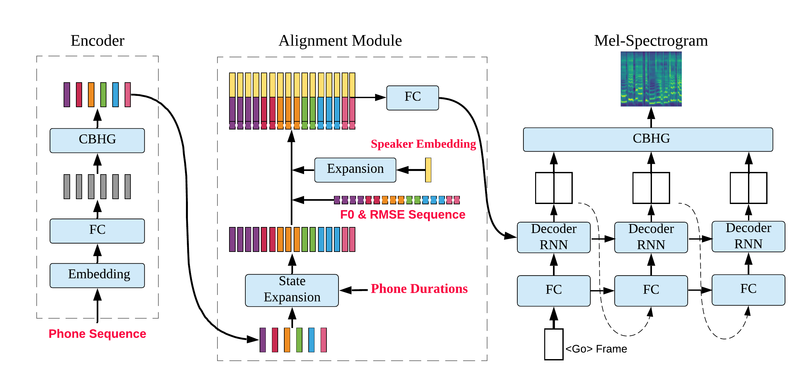

# 
DurIAN-SC: Duration Informed Attention Network based Singing Voice Conversion System

Liqiang Zhang, Chengzhu Yu, Heng Lu, Chao Weng, Chunlei Zhang, Yusong Wu, Xiang Xie, Zijin Li, Dong Yu

Tencent AI Lab

## Abstract

 Singing voice conversion is converting the timbre in the source singing to the target speaker's voice while keeping singing content the same. However, singing data for target speaker is much more difficult to collect compared with normal speech data. In this paper, we introduce a singing voice conversion algorithm that is capable of generating high quality target speaker's singing using only his/her normal speech data. First, we manage to integrate the training and conversion process of speech and singing into one framework by unifying the features used in standard speech synthesis system and singing synthesis system. In this way, normal speech data can also contribute to singing voice conversion training, making the singing voice conversion system more robust especially when the singing database is small. Moreover, in order to achieve one-shot singing voice conversion, a speaker embedding module is developed using both speech and singing data, which provides target speaker identify information during conversion. Experiments indicate proposed sing conversion system can convert source singing to target speaker's high-quality singing with only 20 seconds of target speaker's enrollment speech data.
 

 

 

## Look Up Table(LUT) based speaker embedding & D-vector based speaker embedding 

 
\* Note: All samples are in Mandrin Chinese.
 
\* There are 6 in-set singers---3 male singers and 3 female singers, shown here.
 
\* The "Reference Voice" is shown here for timbre similarity test, which is the target singer's singing. 

 

<table align="center">
  <thead>
    <tr>
      <th> </th>
      <th>Reference Voice</th>
      <th>LUT Sample</th>
      <th>D-vector Sample</th>
    </tr>
  </thead>
  <tbody>
    <tr>
      <th>Female Singer1</th>
      <td><audio controls="" preload="auto">
            <source src="wavs/inset_ref/101.wav"></audio></td>
      <td><audio controls="" preload="auto">
            <source src="wavs/inset_emb/lut_101.wav"></audio></td>
      <td><audio controls="" preload="auto">
            <source src="wavs/inset_dvec/dvec_101.wav"></audio></td>
    </tr>
    <tr>
      <th>Female Singer2</th>
      <td><audio controls="" preload="auto">
            <source src="wavs/inset_ref/238.wav"></audio></td>
      <td><audio controls="" preload="auto">
            <source src="wavs/inset_emb/lut_238.wav"></audio></td>
      <td><audio controls="" preload="auto">
            <source src="wavs/inset_dvec/dvec_238.wav"></audio></td>
    </tr>
    <tr>
      <th>Female Singer3</th>
      <td><audio controls="" preload="auto">
            <source src="wavs/inset_ref/1161.wav"></audio></td>
      <td><audio controls="" preload="auto">
            <source src="wavs/inset_emb/lut_1161.wav"></audio></td>
      <td><audio controls="" preload="auto">
            <source src="wavs/inset_dvec/dvec_1161.wav"></audio></td>
    </tr>
    <tr>
      <th>Male Singer1</th>
      <td><audio controls="" preload="auto">
            <source src="wavs/inset_ref/658.wav"></audio></td>
      <td><audio controls="" preload="auto">
            <source src="wavs/inset_emb/lut_658.wav"></audio></td>
      <td><audio controls="" preload="auto">
            <source src="wavs/inset_dvec/dvec_658.wav"></audio></td>
    </tr>
    <tr>
      <th>Male Singer2</th>
      <td><audio controls="" preload="auto">
            <source src="wavs/inset_ref/1189.wav"></audio></td>
      <td><audio controls="" preload="auto">
            <source src="wavs/inset_emb/lut_1189.wav"></audio></td>
      <td><audio controls="" preload="auto">
            <source src="wavs/inset_dvec/dvec_1189.wav"></audio></td>
    </tr>
    <tr>
      <th>Male Singer3</th>
      <td><audio controls="" preload="auto">
            <source src="wavs/inset_ref/1512.wav"></audio></td>
      <td><audio controls="" preload="auto">
            <source src="wavs/inset_emb/lut_1512.wav"></audio></td>
      <td><audio controls="" preload="auto">
            <source src="wavs/inset_dvec/dvec_1512.wav"></audio></td>
    </tr>
  </tbody>
</table>

 

## Out-of-set test of D-vector based speaker embedding 

 
\* Note: All samples are in Mandrin Chinese.
 
\* There are 4 out-of-set speakers---2 male speakers and 2 female speakers, shown here.
 
\* The "Register Voice" is shown here for similarity test, which is the target speaker's speech.

 

<table align="center">
  <thead>
    <tr>
      <th> </th>
      <th>Register Voice</th>
      <th>D-vector Sample</th>
    </tr>
  </thead>
  <tbody>
    <tr>
      <th>Female Speaker1</th>
      <td><audio controls="" preload="auto">
            <source src="wavs/speech_ref/10004.wav"></audio></td>
      <td><audio controls="" preload="auto">
            <source src="wavs/outset_dvec/dvec_10004.wav"></audio></td>
    </tr>
    <tr>
      <th>Female Speaker2</th>
      <td><audio controls="" preload="auto">
            <source src="wavs/speech_ref/10005.wav"></audio></td>
      <td><audio controls="" preload="auto">
            <source src="wavs/outset_dvec/dvec_10005.wav"></audio></td>
    </tr>
    <tr>
      <th>Male Speaker1</th>
      <td><audio controls="" preload="auto">
            <source src="wavs/speech_ref/10003.wav"></audio></td>
      <td><audio controls="" preload="auto">
            <source src="wavs/outset_dvec/dvec_10003.wav"></audio></td>
    </tr>
    <tr>
      <th>Male Speaker2</th>
      <td><audio controls="" preload="auto">
            <source src="wavs/speech_ref/10001.wav"></audio></td>
      <td><audio controls="" preload="auto">
            <source src="wavs/outset_dvec/dvec_10001.wav"></audio></td>
    </tr>
  </tbody>
</table>

 

## Training with speech corpus

 
\* Note: All samples are in Mandrin Chinese.
 
\* There are 6 in-set speakers---3 male speakers and 3 female speakers, shown here.
 
\* The "Reference Voice" is shown here for timbre similarity test, which is the target speaker's speech. 
 
\* "Speech only" means training only with speech data, while "Speech & Singing" means training with speech data and other singers' singing data. 

 

<table align="center">
  <thead>
    <tr>
      <th> </th>
      <th>Reference Voice</th>
      <th>Speech Only</th>
      <th>Speechh & Singing</th>
    </tr>
  </thead>
  <tbody>
    <tr>
      <th>Male Speaker1</th>
      <td><audio controls="" preload="auto">
            <source src="wavs/speech_ref/10001.wav"></audio></td>
      <td><audio controls="" preload="auto">
            <source src="wavs/speech_only/speech_10001.wav"></audio></td>
      <td><audio controls="" preload="auto">
            <source src="wavs/speech_and_singing/speech_and_sing_10001.wav"></audio></td>
    </tr>
    <tr>
      <th>Male Speaker2</th>
      <td><audio controls="" preload="auto">
            <source src="wavs/speech_ref/10002.wav"></audio></td>
      <td><audio controls="" preload="auto">
            <source src="wavs/speech_only/speech_10002.wav"></audio></td>
      <td><audio controls="" preload="auto">
            <source src="wavs/speech_and_singing/speech_and_sing_10002.wav"></audio></td>
    </tr>
    <tr>
      <th>Male Speaker3</th>
      <td><audio controls="" preload="auto">
            <source src="wavs/speech_ref/10003.wav"></audio></td>
      <td><audio controls="" preload="auto">
            <source src="wavs/speech_only/speech_10003.wav"></audio></td>
      <td><audio controls="" preload="auto">
            <source src="wavs/speech_and_singing/speech_and_sing_10003.wav"></audio></td>
    </tr>
    <tr>
      <th>Female Speaker1</th>
      <td><audio controls="" preload="auto">
            <source src="wavs/speech_ref/10004.wav"></audio></td>
      <td><audio controls="" preload="auto">
            <source src="wavs/speech_only/speech_10004.wav"></audio></td>
      <td><audio controls="" preload="auto">
            <source src="wavs/speech_and_singing/speech_and_sing_10004.wav"></audio></td>
    </tr>
    <tr>
      <th>Female Speaker2</th>
      <td><audio controls="" preload="auto">
            <source src="wavs/speech_ref/10005.wav"></audio></td>
      <td><audio controls="" preload="auto">
            <source src="wavs/speech_only/speech_10005.wav"></audio></td>
      <td><audio controls="" preload="auto">
            <source src="wavs/speech_and_singing/speech_and_sing_10005.wav"></audio></td>
    </tr>
    <tr>
      <th>Female Speaker3</th>
      <td><audio controls="" preload="auto">
            <source src="wavs/speech_ref/10006.wav"></audio></td>
      <td><audio controls="" preload="auto">
            <source src="wavs/speech_only/speech_10006.wav"></audio></td>
      <td><audio controls="" preload="auto">
            <source src="wavs/speech_and_singing/speech_and_sing_10006.wav"></audio></td>
    </tr>
  </tbody>
</table>

 